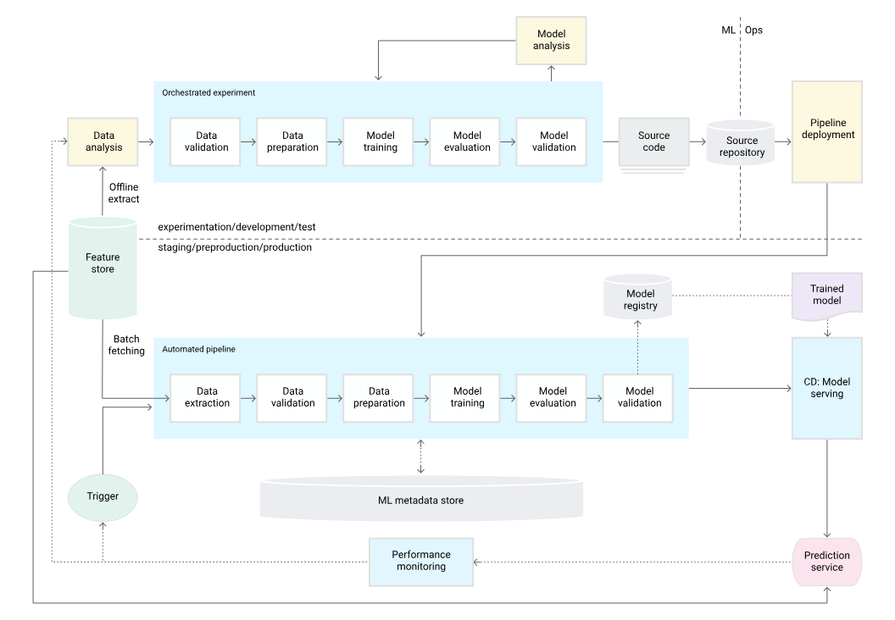
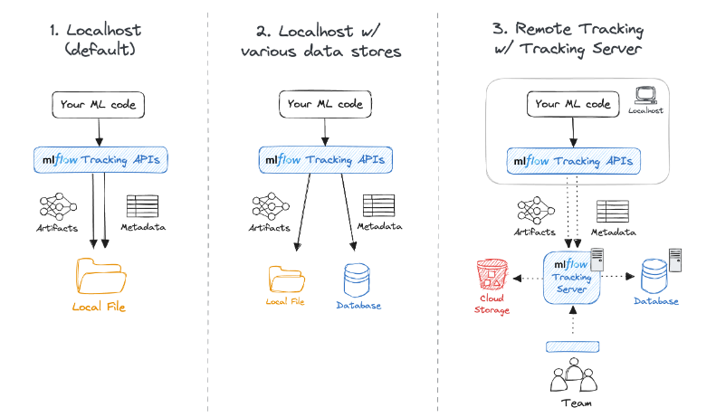

# Notes: BOILER PLATE PROCESS/TEMPLATE

1. open git bash terminal

2.  
```
git init
```

```
git add abc.txt

git add .
```

```
git commit -m "my commit"
```

or
We can use the source code GUI approach > 1. press on plus (+ stage change) > 2. commit message > publish (only 1st time) /sync changes / else tick mark -> the code will go to github 


3. in github > add file > create new file > .gitignore > template:python > save changes
4. in github > add file > create new file > LICENSE > choose the license type > MIT > commit changes

pandas -> BSD 2 License
tensorflow -> Apache License

5. 
```   
git pull
```
6. init_setup.sh -> If I dont want execute all the commands in bash manually, I can use init_setup.sh -> here i can put code for creating the environment, requirements.txt can be downloaded (only used for Linux, can be done using bash/gitbash)
Using the above I can automate the steps.

7. To run the commands in the init_setup.sh we have to run (in git bash terminal)

```
bash init_setup.sh
```

To see shell scripting see tutorialspoint.com/unix/shell_scripting.htm

8. To see the packages in the base, use

```
pip list
```

9. Sometimes in cases of errors we have to manually activate the environment

```
source activate ./env
```

10. Creating folder structure for the project : this is automated (for every project)

ML Project : 
a. Data Ingestion component
b. EDA comp
c. FE comp
d. Model Building comp
e. Evaluation comp

We will create pipeline
a. training
b. prediction

logger file -> for logging the information
exception file
utils file
setup.py -> used for storing local variables
requirements.txt
.gitkeep file -> when we created a folder in local (dev) and we want to push it form local to github
                 but in github we cannot push the empty folder. In that case we can keep those empty files .gitkeep
                 Initially in the yaml file we will keep the .gitkeep


Folder structure follow modular approach
|-.github/ - workflows/ (used for CICD) - yaml (we write the script/configuration here, where script available key value format)
|-Notebook/ - research.ipynb
|-src/ - Diamond_price_prediction/ - component/ - Data_ingestion.py, Preprocessing.py, model_training.py
|      - Pipeline/ - training.py, prediction.py
|      - exception.py
|      - logger.py
|      - utils.py
|-requirements.txt
|-setup.py

11. create template.py file
12. delete the init_setup.sh


Path(filepath) # it will generate system compatible path => doesnt depend on what we are providing

13. delete the init_setup.sh as we will create it using the template file
14. In the terminal run (for industry)

```
python template.py
```

15. __init__.py 

folder - package -> has many modules and withing it we have class and def
file - module or .py

from tensorflow.tensor import mytensor
from folder or package . file or module import class

we can create our own package also
|-Folder/
|-      module (.py) + __init__.py
|-                  class/def

the __init__.py justifies a folder as a package
In virtual environment -> pandas -> pip install pandas
                          custom/local package -> 1. pip install .
                                                  2. -e .
                                                  3. setup.py (python setup.py install)

In Python we test packages

16. update the setup.py file
17. delete the env folder
18. update the requirements.txt
19. update the init_setup.sh
20.   
```
bash init_setup.sh
```

If the environment is not activated by default, -> (some issue with windows)
```
source activate ./env 
```
can be used

21. 

# 1st way -> 
to see the custom/local package in pip list

```
python setup.py install
```

we will see the DiamondPricePrediction file in the pip list

$pip list
Package                Version
---------------------- -----------
DiamondPricePrediction 0.0.1             (This one)
joblib                 1.4.2
numpy                  1.24.4
pandas                 2.0.3
pip                    24.0
python-dateutil        2.9.0.post0
pytz                   2024.1
scikit-learn           1.3.2
scipy                  1.10.1
setuptools             69.5.1
six                    1.16.0
threadpoolctl          3.5.0
tzdata                 2024.1
wheel                  0.43.0


We will see several files created

* The author can give us the package , then author can deploy the project to pypi and then ask us to download from pypi

This is the first way to install custom  packages
Delete build, dist, egg file
```
pip uninstall DiamondPricePrediction
```

```
pip list
```

# 2nd way ->
open the requirements.txt

-e .    (-e -> editable)

```
pip install -r requirements.txt
```
We can again see the egg file

pip list

$ pip list
Package                Version     Editable project location
---------------------- ----------- ------------------------------------------------------------
DiamondPricePrediction 0.0.1       d:\python (full stack)\ineuron self practice\fsds_end_to_end \n
joblib                 1.4.2\n
numpy                  1.24.4\n
pandas                 2.0.3\n
pip                    24.0\n
python-dateutil        2.9.0.post0\n
pytz                   2024.1\n
scikit-learn           1.3.2\n
scipy                  1.10.1\n
setuptools             69.5.1\n
six                    1.16.0\n
threadpoolctl          3.5.0\n
tzdata                 2024.1\n
wheel                  0.43.0

  setup.py is mandatory for using the local packages without it putting  -e . would give error


# 3rd way(the best way)-
Thus using the setup.py we can even install the local as well as external packages.  

* The pip install -r requirements.txt in the init_setup.sh will take care of all the installations, as we have done all the setting in it using the get_requirements function and specifying the in install_requires argument of setup function


https://www.youtube.com/watch?v=Rv6UFGNmNZg


* We can use cookie cutter template also in place of template.py -> Check Krish Naik video


22. Notebook implementation of Project

1st we write the code in the ipynb file in notebooks/research.py
then we convert the code to modular code

HDL and LLD

Data ingestion real time -> Database -> SQL/NoSQL
                                        S3/Azure Blob


Docker learning -> https://www.linkedin.com/learning/docker-for-data-scientists/what-you-should-know?autoSkip=true&resume=false


# When Data is large, say 70gb ---> ??


For plotting -> plotnine is the best

To do xxxxxxxxxxxxxxxxxxxxxxxxxxxxxx
# 29th October'23 session -> component and pipeline implementation
# 4th Nov23 -> creating prediction and web api
# 5th Nov23 Deployment of machine learning project with complete CI-CD
# 18th Nov23 Introduction of MLOps
# Mlflow uses in end to end project


# torch -> Datacamp
# DL -> from FSDS + Master GENAI


# CICD

|<--------Automated--------->
DEV -> Testing (pytest) : unittest/Integration -> QA 
|<--------------------CI--------------------------->


-> Deliver (Docker) -> Deployment -> monitoring and maintenance
|<<<<<<<<<<<<<<<<<<<<<      CD         >>>>>>>>>>>>>>>>>>>>>


local (dev env)  -> github -> github action (server) -> docker image -> AWS ECR / Az Container Repo -> AWS App Runner -> Server
-> deploy -> end point URL


CI = local (dev env)  -> github -> github action (server)
CD = docker image -> AWS ECR / Az Container Repo ->
CD =  AWS App Runner -> Server-> deploy -> end point URL

Self hosted Runner

------------------CICD or MLOPS (Devops for ML)---------------------
1. code available in local dev env
2. from here we are using git to push to github (central repo)
3. github action is an alternative of circleci/jenkins/travisci
   It is a server. server is nothing but a system. There are tools for CICD. On github action we would be running the docker file and creating docker image
4. The image will be pushed to ECR. Here we will save the docker image.
5. We will deploy the code to AWS App runner. In backend it will provide EC2.

1 to 3 - CI
3 TO 4 - Cont Delivery
4 to 5 - Cont Deployment

Docker can be thought as an advanced virtual machine. Docker Engine is responsible for creating container. 

HELM , Kubernates
Microservices


# 5th Nov23 Deployment of machine learning project with complete CI-CD

1. training pipeline and prediction (web api using flask) pipeline
2. local system -> github -> github action(main.yaml which my created configuration) -> we will get a docker image -> push image to ECR -> App Runner

2.1. Create a .github folder inside project root directory. Inside the .github folder create another folder named workflows. Inside the workflows folder create main.yaml file
In the root directory create a File, Dockerfile(No extension needed)
-> We create the docker file for creating a docker image
-> Docker file is a set of instruction (specify the base image and also the configuration)

app -> Dockerfile -> Docker image -> Docker container

set of instruction:
> I require Python
> I want to instruct to push the codes from working directory  to app directory inside docker
> install the requirements.txt packages
> python app.py

See dockerhub -> we can find images


**Dockerfile:**
_____________

FROM python:3.8-slim-buster            (We are fetching from dockerhub)
WORKDIR /service                       (Creating in dockerfile)
COPY requirements.txt .
COPY . ./
RUN pip install -r requirements.txt
ENTRYPOINT ["python3", "app.py"]       (it allows to set a default command and parameters, ENTRYPOINT["executable", "param1", "param2"])

**Note:**
> Once we open the github -> Actions -> New Workflows (We can see Python Package, Docker image)

**main.yaml: (Author is using the template from github action)**

GITHUB SERVER TO ECR (AWS SERVER)

__________
name: Build and push image to ECR
on:                                      |
    push:                                |  When ever you are pushing anything in the main branch then only you need to run this workflow
        branches:                        | 
            -main                        |

jobs:                                    | These are the tasks that I would perform using github action
    build-and-push-ecr-image:
        name: Build Image
        **runs-on: ubuntu-latest**           | which machine i am using
        steps:
        -name: Check out code
         uses: actions/checkout@v2
        -name: Install Utilities
         run: |
             **sudo apt-get update**                         | Update the ubuntu machine
             **sudo apt-get install -y jq unzip**            |  ----------''------------
        -name: Configure AWS credentials
         uses: aws-actions/configure-aws-credentials@v1
         with:
            aws-access-key-id: ${{secrets.AWS_ACCESS_KEY_ID}}                    |to make connection from github server to aws
            aws-secret-access-key: ${{secrets.AWS_SECRET_ACCESS_KEY}}            |---------------------''---------------------
            aws-region: us-east-1                                                |
        -name: Login to Amazon ECR
         id: login-ecr
         uses: aws-actions/amazon-ecr-login@v1
        -name: Build, tag and push image to Amazon ECR
         env:
            ECR_REGISTRY: ${{steps.login-ecr.outputs.registry}}
            ECR_REPOSITORY: github-sample                                        |ECR repository name created in AWS (Place the exact name)
            IMAGE_TAG: latest
        run: |
            docker build -t $ECR_REGISTRY/$ECR_REPOSITORY:$IMAGE_TAG             |building the image
            docker push $ECR_REGISTRY/$ECR_REPOSITORY:$IMAGE_TAG                 |pushing the image


In the code , app.py mention
if __name__ == "__main__":
    app.run(host = "0.0.0.0", port=8080)


> We have to merge the codes to main branch
> click on action -> we can see the workflow

Click on AWS console
> Search ECR
> create a repo (private) -> create repo

In new screen search IAM
> create new users -> permission(attached policy directly) -> Administrator access -> next
> click on user -> click on security credential -> create access key -> next
> access key and secret access key (download .csv)

By using it we can connection between github action server and aws server

Now we have to mention the access key and the secret access key in the github repo
> click on setting
> secrets and actions
> select the secrets -> new repository secret
> Name: AWS_ACCESS_KEY_ID , Secret: copy past the access key id                       |we can see them in the yaml file
> select the secrets -> new repository secret
> Name: AWS_SECRET_ACCESS_KEY, Secret: copy paste the secret                          |we can see them in the yaml file


As soon as I integrate anything with my repository in github and push it to main branch, the deployment pipeline will be triggered


Go to Actions - we can see the image being built
Now when we go to ECR we can see our image

Now we have to deploy the image
> Search AWS App Runner(A serverless service)
> Repository Type -> Container registry [SELECT THIS]      or Source Code Repository
> Provider -> Amazon ECR [SELECT THIS]    or Amazon ECR Public
> Container image URI -> browse and select,  Image tag -> latest
> Deployment Trigger -> Automatic (App Runner monitors your registry and deploys a new version of your service for each image push)
> ECR access role -> Create access role
> Next -> Service Name: Give a name, Select the Virtual CPU and Virtual Memory, Port: 8080 
> Next
> Create and Deploy(It will take 5-7 min)


We are deploying as docker Image
Serverless -> EBS, App Runner , AWS Lambda, Here we dont need to configure the server

The default domain that is generated by the App runner can be sent to users and then they can access
The routes (as mentioned using flask or fast api)we can use to access multiple analysis we want


1. You need to ready the code in your local
2. you need to create your own repo on github and push this code to your github
   < After cloning some one's repo you will get .git folder also in your repo. it might be hidden folder so first delete that .gitfolder and init your git with command git init then follow the further setup for pushing the code to your github repo>
3. here if i am performing ci/cd so this workflow is very important
   make sure you have .github/workflows/main.yaml
4. and create the docker file since i am doing the deployment in form of the docker image
5. edit the app.py file write app.run(host="0.0.0.0", port=8080)
6. you need to sign up or login to your aws account
7. you need to config three thing
   7.1 create an IAM user
       < search IAM / user/ create user/ attached policy/ administrator access/ download the secrets>
   7.2 create a ECR repo
   7.3 config the app runner
8. add variables in to github repo as secret & variables -> AWS_KEY_ID and AWS_SECRET_ACCESS_KEY,   < setting -> secret and variables/action/secret -> click on new repo secret>
9.  in workflow file check you have mentioned the correct ECR repo name and region


The end user will use the endpoint URL

How we fill the yaml file?
We get the templates for the various workflows


**Introduction to MLOps**
MLOps tools - mlflow, dvc, bentoml, cortex, cometml, tfx, evidently

Development :
code -> testing or staging (unit ot integration)-> QA/QC(Non tech)

Operation or Production:
Delivery -> Deployment -> Monitoring ->
Maintenance

SDLC - software development life cycle

Currently agile methodology followed
previously waterfall methodology was followed

task splitted into sprint
CRISP DM

Code versioning -> git/github
testing -> github action, pytest for testing or jenkins
QC/QA -> visual check
Deployment ->cloud
maintenance -> cloud watch


**Terms:**
1. data versioning - DVC (Create version of the data)
2. SCM (gitub/gitlab/bitbucket)
3. Experiment Tracking (mlflow, dvc) 
4. Feature Store (feast)
5. Model Serving (bentoml, tfx) URL
6. Model Monitoring (grifana, promethius)
7. Model registry (mlflow)
8. workflow/scheduling (airflow)
9. containerization (docker) 
10. manage containerization (kubeflow)
11. infra configuration management (terraform - Infra as code, yml file)
12. managing configuration -> ansible/puppet
13. Cloud -> GCP - Vertex AI, AWS - Sagemaker, Azure- ML Studio, Databricks - Databricks


MLOPS ->
    Configuration
    data collection
    testing debugging
    resource management
    serving infra
    model analysis
    ml code
    process management
    monitoring
    metadata management
    feature engineering
    data verification
    automation


CT -> continuous training -> Airflow

See architecture from Google

https://cloud.google.com/architecture/mlops-continuous-delivery-and-automation-pipelines-in-machine-learning





**AWS:**
Serverless operation -> AWS Lambda
NoSQL db -> Mongodb
SQL - RDS
Data warehouses - Redshift
github - code commit


**mlflow:**
with mlflow.start_run():

mlflow.log_param("X",X)

IN TERMINAL -> mlflow ui

we keep it (mlflow) in modularized code.

https://mlflow.org/docs/latest/tracking.html




